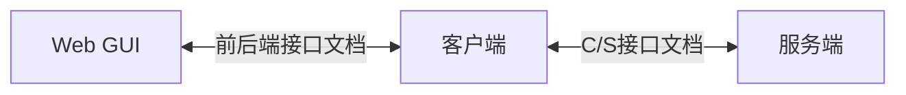
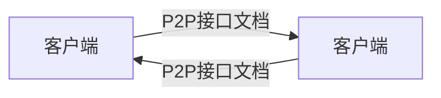

# 项目文档

## 项目总览

## 总功能列表

1. 注册
2. 登陆
3. 密钥协商
4. 发送数据
   1. 通讯录管理
   2. 即时通讯

## 额外功能

1. 语音聊天
2. docker
3. 群聊
4. P2P 打洞
5. 离线消息接收
6. 前后端支持历史记录增量获取
7. token过期
8. 最后在线时间记录
9. 心跳系统

## 具体实现

1. 注册

   Web 端发送请求至客户端，客户端 POST 信息至服务端，结果回传 Web 端

2. 登陆

   同注册

3. 密钥协商

   客户端在登陆后自动将公钥发送给服务端

4. 发送数据

   - 通讯录管理
     - Web 端发送请求至客户端，客户端向服务端 GET 通讯录列表，结果回传 Web 端

   - 即时通讯（GET 通讯录列表后可用）
     - Web 端发送请求至客户端，客户端向服务端 GET 对应客户端状态、地址、公钥，客户端根据对应地址与公钥进行客户端间即时通讯

## 实现架构

- 前端
  - Vue
- 后端
  - Flask