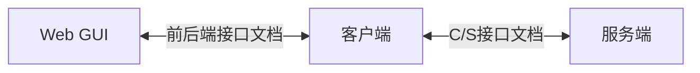
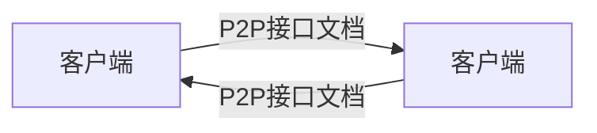

# 项目文档

## 项目总览

## 总功能列表

1. 注册
2. 登陆
3. 密钥协商
4. 发送数据
   1. 通讯录管理
   2. 即时通讯
   3. 消息隐藏

## 额外功能

1. 语音聊天
2. docker
3. 群聊
4. P2P 打洞
5. 离线消息接收
6. 前后端支持历史记录增量获取
7. token 过期
8. 最后在线时间记录
9. 心跳系统
10. 搜索聊天记录
11. 拒绝加好友

## 实现架构

- 前端
  - Vue
- 后端
  - Flask
