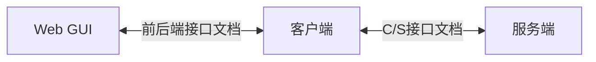
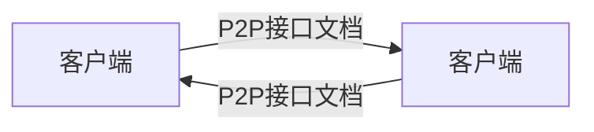

# 项目文档

## 项目总览

## 总功能列表

1. 注册
2. 登陆
3. 发送数据
   1. 通讯录管理
   2. 添加好友
   3. 删除好友
   4. 判断是否在线
   5. 获取公钥
   6. 即时通讯
   7. 聊天记录查询
   8. 消息隐藏

## 额外功能

1. 语音聊天
2. docker
3. 群聊
4. P2P 打洞
5. 离线消息接收
6. 前后端支持信息增量获取
7. token 过期
8. 最后在线时间记录
9. 心跳系统
10. 搜索聊天记录
11. 拒绝加好友

## 架构

- Web 端
  - Vue
- 客户端
  - Flask
  - TinyDB
- 服务端
  - Flask
  - MySQL
  

## 服务端数据库（MySQL）

- Users
  - user_id
  - email
  - password
- Contacts
  (A, B, 1) 存在代表 A 向 B 发送了好友申请
  (A, B, 1), (B, A, 1) 都存在代表 A 与 B 是好友
  - user_A
  - user_B
  - flag
- Online
  - user_id
  - state
  - public_key
  - ip
  - port

## 客户端数据库（json）

- Friends
  - friend_id
  - public_key
  - ip
  - port
- Messages
  - timestamp
  - sender_id
  - receiver_id
  - message

## 具体实现

- 注册
  - Web 发送请求至客户端，客户端转发请求至服务端
  - Web 端请求内容：POST(user_id, password, email)
  - 服务端查询 Users 表
  - 服务端回传响应至客户端，客户端处理响应
- 登陆
  - Web 发送请求至客户端，客户端转发请求至服务端
  - Web 端请求内容：POST(user_id, password, public_key, ip, port)
  - 服务端查询 Users 表并判断用户是否存在，将用户公钥与状态存入 Online 表
  - 服务端回传响应至客户端，客户端处理响应
  - 服务端响应内容：(token)
- 通讯录管理
  - Web 发送请求至客户端，客户端转发请求至服务端
  - Web 端请求内容：GET()
    **token 在客户端存储，Web 端发送 GET 时无需附带 token，客户端转发请求时需要附带 token**
  - 服务端根据请求中的用户 user_id 查询 Contacts 表，选出所有的 (user_A, flag) where user_B = user_id
  - 客户端根据响应中的 flag 位判断新好友申请与好友
- 添加好友
  - Web 发送请求至客户端，客户端转发请求至服务端
  - Web 端请求内容：POST(token, friend_id)
    **token 在客户端存储，Web 端发送 POST 时无需附带 token，客户端转发请求时需要附带 token**
  - 服务端查询 Users 表并判断好友是否存在，存在则将 flag 存入 Contacts 表
  - 服务端回传响应至客户端，客户端处理响应
- 删除好友
  - Web 发送请求至客户端，客户端转发请求至服务端
  - Web 端请求内容：DELETE(token, friend_id)
    **token 在客户端存储，Web 端发送 DELETE 时无需附带 token，客户端转发请求时需要附带 token**
  - 服务端查询 Contacts 表并判断关系是否存在，存在则将 flag 存入 Contacts 表
  - 服务端回传响应至客户端，客户端处理响应
- 判断是否在线
  - Web 发送请求至客户端，客户端转发请求至服务端
  - Web 端请求内容：POST(token, friend_id)
    **token 在客户端存储，Web 端发送 POST 时无需附带 token，客户端转发请求时需要附带 token**
  - 服务端查询 Contacts 表并判断关系是否存在，存在则查询 Online 表
  - 服务端回传响应至客户端，客户端处理响应
- 获取公钥
  - Web 发送请求至客户端，客户端转发请求至服务端
  - Web 端请求内容：POST(token, friend_id)
    **token 在客户端存储，Web 端发送 POST 时无需附带 token，客户端转发请求时需要附带 token**
  - 服务端查询 Contacts 表并判断关系是否存在，存在则查询 Online 表
  - 服务端回传响应至客户端，客户端处理响应
  - 服务端响应内容：(public_key, ip, port)
- 即时通讯
  - Web 发送请求至客户端，客户端查询数据库
  - Web 端请求内容：POST(friend_id , message)
    **客户端间通信格式：(timestamp, sender_id, receiver_id(friend_id), message)**
  - 客户端根据数据库中数据发起即时通讯，流程为：
    - 判断能否连接
    - 生成临时对称密钥
    - 使用对方公钥加密临时密钥
    - 使用临时密钥加密消息并发送
- 聊天记录查询
  - Web 发送请求至客户端，客户端查询数据库
  - Web 端请求内容：POST(friend_id)
  - 客户端根据响应查询 Messages 表，选出所有的 (message) where sender_id = user_id and receiver_id = friend_id or sender_id = friend_id and receiver_id = user_id
  - 客户端响应内容：(length, messages)
- 消息隐藏
  - Web 发送请求至客户端，客户端将消息嵌入图片
  - 复用即时通讯接口

